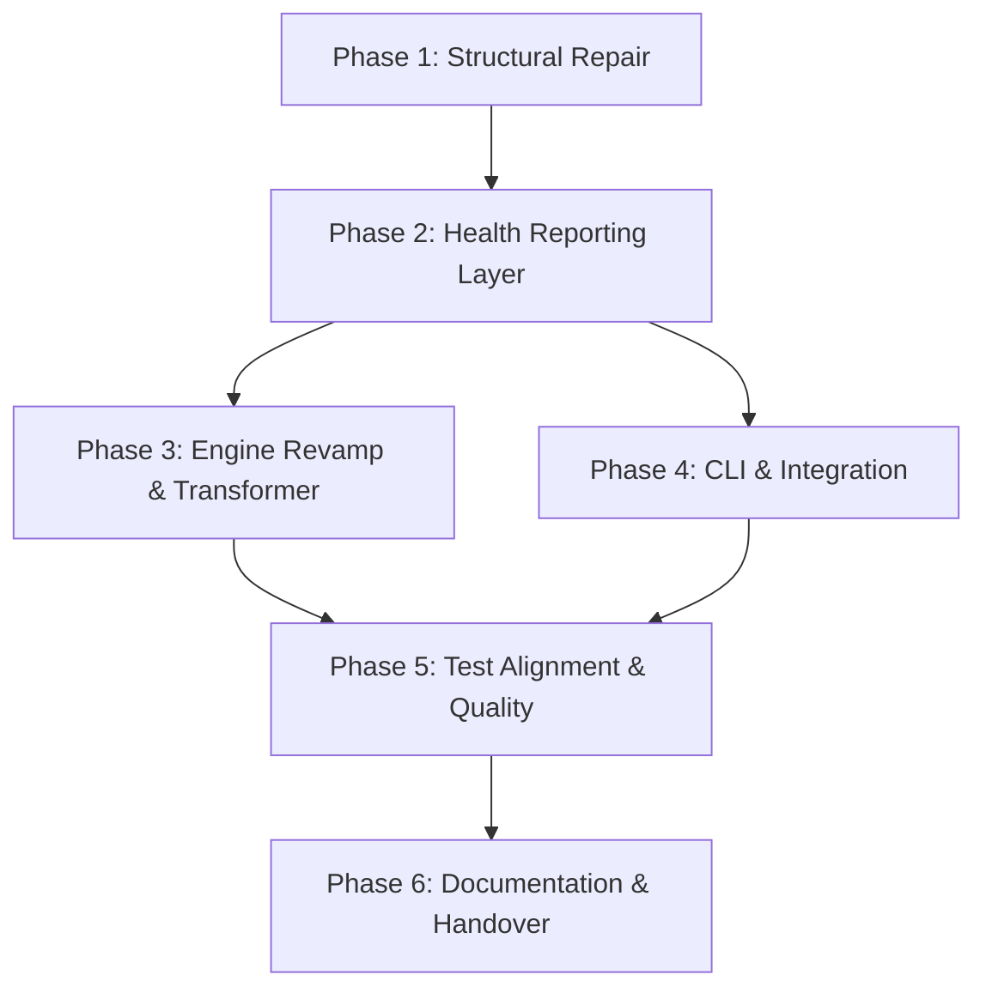

# Implementation Plan: BS-OPT MLOps Revamp (Integrated Health Mesh)

## 1. Plan Overview
This plan details the multi-phase revamp of the BS-OPT MLOps engine. It covers structural repairs, the introduction of a centralized Health Reporting layer, enhancement of the autonomous engine with Transformer-based detection, and comprehensive test alignment.

**Total Phases**: 6
**Agents Involved**: `refactor`, `coder`, `tester`, `technical_writer`, `code_reviewer`
**Estimated Effort**: 3-4 days

## 2. Dependency Graph

## 3. Execution Strategy Table
| Stage | Phases | Mode | Agents |
|-------|--------|------|--------|
| Foundation | 1 | Sequential | `refactor` |
| Core Domain | 2 | Sequential | `coder` |
| Parallel Dev | 3, 4 | Parallel | `coder` |
| Quality | 5 | Sequential | `tester` |
| Finalize | 6 | Sequential | `technical_writer`, `code_reviewer` |

## 4. Phase Details

### Phase 1: Structural Repair (Foundation)
**Objective**: Fix broken import paths in `src/ml/feature_store/` and unify `Feature` base classes.
**Agent**: `refactor`
**Files to Modify**:
- `src/ml/feature_store/features.py`: Update import `from src.math_kernel.base import Feature` to `from .base import Feature`.
- `src/ml/feature_store/store.py`: Update import `from src.math_kernel.base import Feature, FeatureStore` to `from .base import Feature, FeatureStore`.
**Validation**:
- `uv run ruff check src/ml/feature_store/`
- `uv run mypy src/ml/feature_store/`

### Phase 2: Health Reporting Layer (Core Domain)
**Objective**: Implement the `HealthReporter` class and the diagnostic schema.
**Agent**: `coder`
**Files to Create**:
- `src/ml/aiops/health_reporter.py`: New aggregator class.
- `src/ml/aiops/schemas.py`: Diagnostic report schema (Pydantic/msgspec).
**Files to Modify**:
- `src/ml/main.py`: Add `GET /ml/health` endpoint.
**Validation**:
- `uv run pytest tests/unit/test_health_reporter.py` (to be created)
- Manual `curl` to local FastAPI instance.

### Phase 3: Engine Revamp & Transformer (Core Domain)
**Objective**: Enhance `AutonomousEngine` with Transformer detection and unified reporting triggers.
**Agent**: `coder`
**Files to Modify**:
- `src/ml/aiops/autonomous_engine.py`: Enable `TimeSeriesTransformerEncoder` by default, integrate with `HealthReporter`.
- `src/ml/aiops/anomaly_detector.py`: Ensure `transformer` engine is fully functional and tested.
**Validation**:
- `uv run pytest tests/ml/test_drift.py`
- `uv run pytest tests/unit/test_anomaly_detector.py`

### Phase 4: CLI & Integration (Infrastructure)
**Objective**: Create the `bin/ml-health` CLI tool and integrate with existing MLOps scripts.
**Agent**: `coder`
**Files to Create**:
- `bin/ml-health`: Python script for CLI status reporting.
- `scripts/health_check.sh`: Wrapper script.
**Files to Modify**:
- `MLproject`: Correct entry point paths (e.g., `src.ml.aiops.data_drift_detector`).
**Validation**:
- `./bin/ml-health --help`
- `./bin/ml-health --summary`

### Phase 5: Test Alignment & Quality (Quality)
**Objective**: Update legacy tests and add integration tests for the Health Mesh.
**Agent**: `tester`
**Files to Modify**:
- `tests/unit/test_aiops_engine.py`: Rename `AIOpsOrchestrator` to `AutonomousEngine`, update mocks.
- `tests/e2e/test_aiops_e2e.py`: Update to match new architecture.
**Validation**:
- `uv run pytest tests/ml/`
- `uv run pytest tests/unit/test_aiops_engine.py`

### Phase 6: Documentation & Handover (Documentation)
**Objective**: Update project documentation and provide a health report.
**Agent**: `technical_writer`
**Files to Modify**:
- `README.md`: Add section on MLOps Health Reporting.
- `docs/MLOPS_REVAMP.md`: New design and usage document.
**Validation**:
- Markdown linting.
- Final `bin/ml-health` report showing "Optimal".

## 5. Cost Estimation
| Phase | Agent | Model | Est. Input | Est. Output | Est. Cost |
|-------|-------|-------|--|--|--|
| 1 | `refactor` | Pro | 5K | 1K | $0.09 |
| 2 | `coder` | Pro | 10K | 3K | $0.22 |
| 3 | `coder` | Pro | 15K | 5K | $0.35 |
| 4 | `coder` | Pro | 10K | 2K | $0.18 |
| 5 | `tester` | Pro | 20K | 5K | $0.40 |
| 6 | `technical_writer`| Flash | 10K | 5K | $0.03 |
| **Total** | | | **70K** | **21K** | **$1.27** |

## 6. Execution Profile
- Total phases: 6
- Parallelizable phases: 2 (Phases 3 and 4)
- Sequential-only phases: 4
- Estimated parallel wall time: ~4 hours
- Estimated sequential wall time: ~6 hours

Note: Native parallel execution currently runs agents in autonomous mode. All tool calls are auto-approved without user confirmation.
