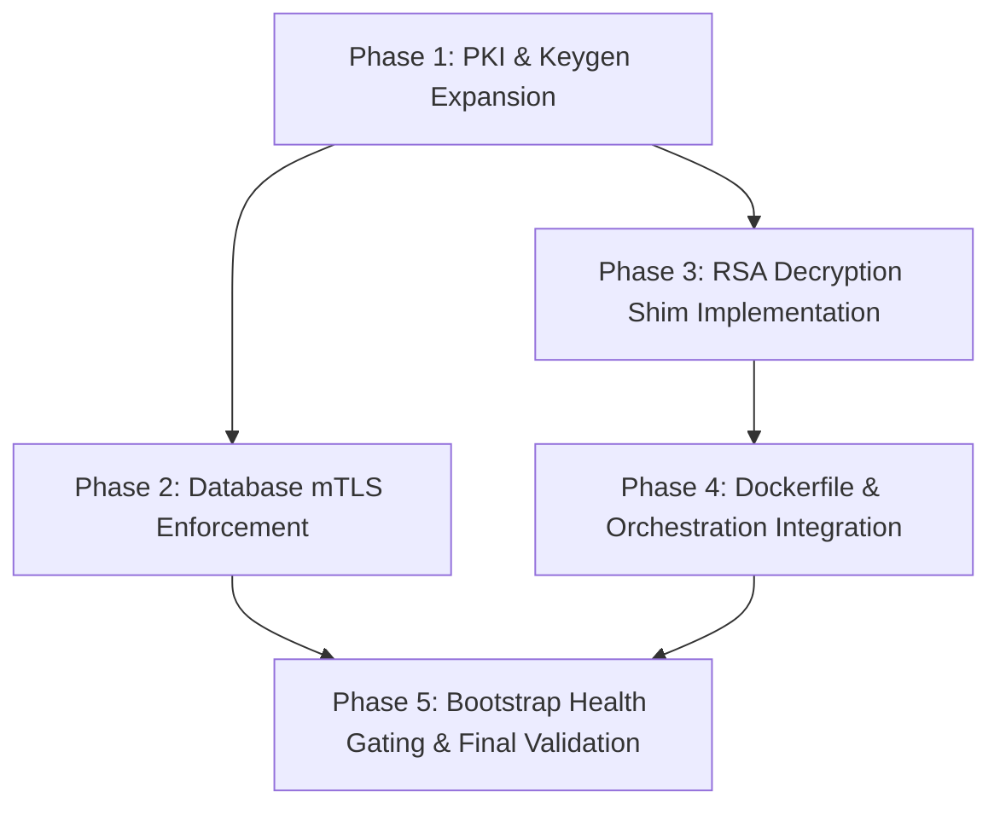

# Implementation Plan: Phase 0 - Zero-Touch Infrastructure & Auth Bootstrapping

**Date**: 2026-03-20
**Task Complexity**: Complex
**Workflow Mode**: Standard

## 1. Plan Overview
This plan implements Phase 0 of the EquaFlow platform, establishing a zero-trust, institutional-grade infrastructure. Key deliverables include a Root CA-based mTLS boundary for the database, a cryptographic vaulting mechanism for environment variables, and a hardened bootstrap process with sequential health gating.

## 2. Dependency Graph

## 3. Execution Strategy
| Phase | Objective | Agent | Validation |
|-------|-----------|-------|------------|
| 1 | Expand PKI to generate Root CA & Client Certs | `devops_engineer` | `ls -R .pki` and cert verification |
| 2 | Enforce mTLS in pg_hba.conf | `data_engineer` | `pg_isready` with certs |
| 3 | Create RSA Decryption Entrypoint Shim | `security_engineer` | `openssl pkeyutl` decrypt test |
| 4 | Integrate Shim into Dockerfiles & Compose | `devops_engineer` | `make build` and env check |
| 5 | Update Bootstrap Health Gating | `devops_engineer` | `make up` finish time < 120s |

## 4. Phase Details

### Phase 1: PKI & Keygen Expansion
- **Objective**: Expand `bootstrap.sh` or `scripts/setup_pki.sh` to generate a full internal PKI hierarchy.
- **Agent**: `devops_engineer`
- **Files to Modify**: `bootstrap.sh`, `scripts/setup_pki.sh`
- **Implementation Details**:
    - Create a Root CA (RSA 4096).
    - Generate server certificates for `postgres` and `envoy`.
    - Generate client certificates for each app service (CN matches service name).
    - Generate a dedicated "Vault RSA 4096" key pair for secret encryption.
- **Validation**: `openssl verify -CAfile .pki/ca.crt .pki/postgres.crt`

### Phase 2: Database mTLS Enforcement
- **Objective**: Restrict database access to SSL-only with certificate verification.
- **Agent**: `data_engineer`
- **Files to Modify**: `infrastructure/configs/pg_hba.conf`, `infrastructure/configs/postgresql.conf`
- **Implementation Details**:
    - Set `ssl = on` and `ssl_ca_file = '/etc/postgresql/ca.crt'` in `postgresql.conf`.
    - Update `pg_hba.conf` to use `hostssl` with `cert clientcert=verify-full`.
    - Map CNs to database users in `pg_ident.conf`.
- **Validation**: Attempt connection without cert (should fail) and with cert (should succeed).

### Phase 3: RSA Decryption Entrypoint Shim
- **Objective**: Implement a shell-based helper to decrypt encrypted env vars at runtime.
- **Agent**: `security_engineer`
- **Files to Create**: `infrastructure/scripts/entrypoint-shim.sh`
- **Implementation Details**:
    - Iterate through all env vars matching a prefix (e.g., `ENC_`).
    - Decrypt value using `openssl pkeyutl -decrypt -inkey /app/keys/vault.key`.
    - Export the result as the base variable name (e.g., `ENC_DB_PASS` -> `DB_PASS`).
    - Unset the `ENC_` variable.
- **Validation**: Local test script with an encrypted string.

### Phase 4: Dockerfile & Orchestration Integration
- **Objective**: Standardize all services on the new entrypoint and mTLS connection strings.
- **Agent**: `devops_engineer`
- **Files to Modify**: `infrastructure/orchestration/Dockerfile.api-dev`, `infrastructure/orchestration/Dockerfile.auth-service-dev`, `infrastructure/orchestration/docker-compose.yml`
- **Implementation Details**:
    - Copy `entrypoint-shim.sh` to each container.
    - Set `ENTRYPOINT ["/usr/local/bin/entrypoint-shim.sh"]`.
    - Update service connection strings in `.env` to include `sslmode=verify-full` and paths to client certs.
- **Validation**: `make build` and check container logs for "Decryption complete".

### Phase 5: Bootstrap Health Gating & Final Validation
- **Objective**: Ensure the entire stack starts sequentially and securely.
- **Agent**: `devops_engineer`
- **Files to Modify**: `bootstrap.sh`
- **Implementation Details**:
    - Implement a strict polling loop for RabbitMQ and Auth service health.
    - Add a step to encrypt sensitive values in the `.env` file using the Vault Public Key.
- **Validation**: Complete `make up` and run a smoke test `pytest tests/test_auth.py`.

## 5. File Inventory
| Phase | Action | Path | Purpose |
|-------|--------|------|---------|
| 1 | Modify | `bootstrap.sh` | PKI generation logic |
| 2 | Modify | `infrastructure/configs/pg_hba.conf` | mTLS enforcement |
| 3 | Create | `infrastructure/scripts/entrypoint-shim.sh` | Runtime decryption |
| 4 | Modify | `infrastructure/orchestration/docker-compose.yml` | mTLS connection strings & mounts |
| 4 | Modify | `infrastructure/orchestration/Dockerfile.api-dev` | Entrypoint integration |

## 6. Execution Profile
- **Total phases**: 5
- **Parallelizable phases**: 2 (Phase 2 and Phase 3 are independent)
- **Sequential-only phases**: 3
- **Estimated Wall Time**: 20-30 minutes

## 7. Cost Estimation
| Phase | Agent | Model | Est. Input | Est. Output | Est. Cost |
|-------|-------|-------|-----------|------------|----------|
| 1 | `devops_engineer` | Flash | 20,000 | 1,000 | $0.03 |
| 2 | `data_engineer` | Flash | 15,000 | 500 | $0.02 |
| 3 | `security_engineer` | Pro | 10,000 | 500 | $0.12 |
| 4 | `devops_engineer` | Flash | 25,000 | 1,500 | $0.04 |
| 5 | `devops_engineer` | Flash | 15,000 | 500 | $0.02 |
| **Total** | | | | | **$0.23** |
