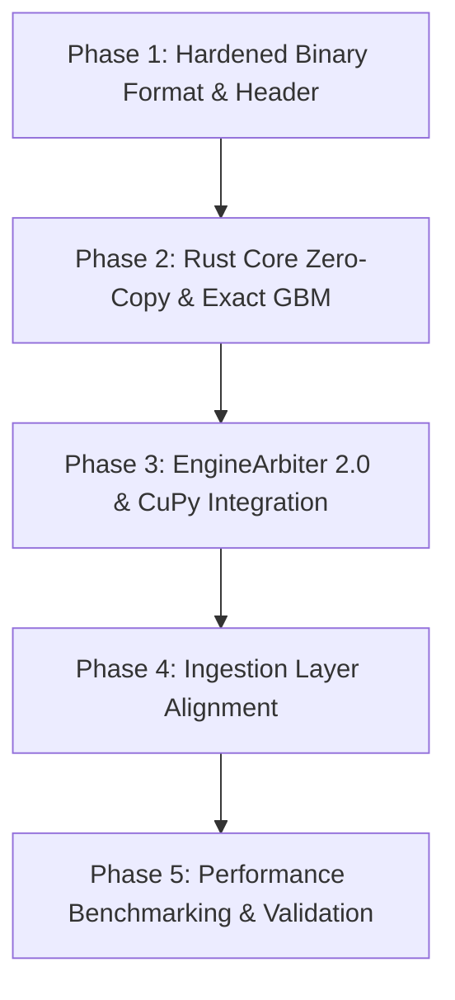

# Implementation Plan: Phase 1 - Rust Integration & Advanced Mathematical Kernels

**Date**: 2026-03-20
**Task Complexity**: Complex
**Workflow Mode**: Standard

## 1. Plan Overview
This plan implements the high-performance compute foundation for EquaFlow. It involves upgrading the Rust core for true zero-copy data parsing, implementing exact analytical solutions for stochastic simulations, and integrating GPU acceleration into the unified math arbiter.

## 2. Dependency Graph

## 3. Execution Strategy
| Phase | Objective | Agent | Validation |
|-------|--|-------|--|
| 1 | Define & Implement Hardened 32-byte Binary Standard | `data_engineer` | Magic byte & header check |
| 2 | Refactor Rust Core: Zero-Copy Views & Exact GBM | `coder` | `cargo test` & `PyArray` check |
| 3 | EngineArbiter 2.0: Multi-Hardware Routing | `api_designer` | GPU/CPU routing logic tests |
| 4 | Align Ingestion Layer with Rust Parser | `coder` | End-to-end tick flow test |
| 5 | Performance & Precision Gauntlet | `performance_engineer` | Throughput > 5M options/sec |

## 4. Phase Details

### Phase 1: Hardened Binary Format & Header
- **Objective**: Establish the `EQUA` binary standard.
- **Agent**: `data_engineer`
- **Files to Create**: `src/shared/utils/binary_format.py`
- **Implementation Details**:
    - Define header: `Magic: EQUA (4b)`, `Version: u16 (2b)`, `MetadataLen: u16 (2b)`.
    - Record structure (32b): `Symbol: 12b (UTF-8)`, `Price: 8b (f64)`, `Volume: 4b (i32)`, `Timestamp: 8b (i64 nanoseconds)`.
    - Create a conversion utility from CSV/JSON to `.equa` format.
- **Validation**: Read back header and first 10 records.

### Phase 2: Rust Core Zero-Copy & Exact GBM
- **Objective**: Maximize throughput via `PyArray` and analytical precision.
- **Agent**: `coder`
- **Files to Modify**: `src/math_kernel/rust-core/src/lib.rs`, `src/math_kernel/rust-core/Cargo.toml`
- **Implementation Details**:
    - Update `TickDataBuffer` to return `&PyArray2<f64>` views of mmap data (using `numpy` crate).
    - Implement `exact_gbm_path` using the analytical exponential formula.
    - Standardize all Normal CDF calls on A&S 7.1.26.
    - Remove iterative RK4/Milstein hybrids if analytical is available.
- **Validation**: `pytest` matching Rust output with Python analytical baseline.

### Phase 3: EngineArbiter 2.0 & CuPy Integration
- **Objective**: Seamlessly route to GPU when available.
- **Agent**: `api_designer`
- **Files to Modify**: `src/math_kernel/arbiter.py`, `src/math_kernel/cuda_kernels.py`
- **Implementation Details**:
    - Add `GPU` to `PricingModel` enum.
    - Update `route_batch` to check `CUPY_AVAILABLE` and `len(batch) > threshold`.
    - Ensure `cuda_kernels.py` uses the same A&S 7.1.26 approximation as Rust.
- **Validation**: Mock `CUPY_AVAILABLE=True` and verify routing.

### Phase 4: Ingestion Layer Alignment
- **Objective**: Connect the scraper firehose to the Rust parser.
- **Agent**: `coder`
- **Files to Modify**: `src/ingestion/rust_parser.py`, `src/ingestion/engine.py`
- **Implementation Details**:
    - Update `RustTickParser` to handle the new `.equa` header.
    - Switch from `parse_batch` (Vec return) to `get_view` (PyArray return).
- **Validation**: Parse 100k ticks and verify zero-copy via memory profiling.

### Phase 5: Performance Benchmarking & Validation
- **Objective**: Prove institutional-grade performance.
- **Agent**: `performance_engineer`
- **Files to Create**: `scripts/benchmarks/math_gauntlet.py`
- **Implementation Details**:
    - Benchmark 1M, 5M, 10M option batches on CPU (Rust) vs GPU (CuPy).
    - Verify numerical precision match between backends to 1e-7.
- **Validation**: Output benchmark report to `docs/performance/phase-1-report.md`.

## 5. File Inventory
| Phase | Action | Path | Purpose |
|-------|--------|------|---------|
| 1 | Create | `src/shared/utils/binary_format.py` | Binary standard definition |
| 2 | Modify | `src/math_kernel/rust-core/src/lib.rs` | Zero-copy & Exact GBM |
| 3 | Modify | `src/math_kernel/arbiter.py` | Routing logic |
| 4 | Modify | `src/ingestion/rust_parser.py` | Rust wrapper update |

## 6. Execution Profile
- **Total phases**: 5
- **Parallelizable phases**: 2 (Phase 1 and Phase 3 are independent)
- **Sequential-only phases**: 3
- **Estimated Wall Time**: 40-60 minutes

## 7. Cost Estimation
| Phase | Agent | Model | Est. Input | Est. Output | Est. Cost |
|-------|-------|-------|--|--|--|
| 1 | `data_engineer` | Flash | 15,000 | 800 | $0.02 |
| 2 | `coder` | Pro | 30,000 | 2,000 | $0.38 |
| 3 | `api_designer` | Flash | 15,000 | 500 | $0.02 |
| 4 | `coder` | Flash | 20,000 | 1,000 | $0.03 |
| 5 | `performance_engineer` | Flash | 15,000 | 500 | $0.02 |
| **Total** | | | | | **$0.47** |
