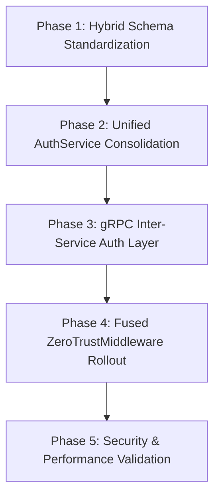

# Implementation Plan: Phase 2 - Single-Source Zero-Trust Auth & Backend Refinement

**Date**: 2026-03-20
**Task Complexity**: Complex
**Workflow Mode**: Standard

## 1. Plan Overview
This plan implements the EquaFlow security consolidation. It involves unifying fragmented auth logic into a single high-performance `AuthService`, enforcing a fused zero-trust middleware (JWT + mTLS) across all services, and standardizing on a high-performance Pydantic V2 + msgspec schema pattern.

## 2. Dependency Graph

## 3. Execution Strategy
| Phase | Objective | Agent | Validation |
|-------|-----------|-------|------------|
| 1 | Standardize msgspec + Pydantic V2 hybrid pattern | `coder` | Schema unit tests |
| 2 | Consolidate auth logic into unified `AuthService` | `coder` | Argon2id & MFA tests |
| 3 | Implement gRPC server/client for inter-service auth | `api_designer` | gRPC ping & validate tests |
| 4 | Deploy Fused ZeroTrustMiddleware with Proxy Trust | `security_engineer` | mTLS spoof & JWT tests |
| 5 | Performance & Security Gauntlet | `performance_engineer` | 10k req/s load test |

## 4. Phase Details

### Phase 1: Hybrid Schema Standardization
- **Objective**: Apply the `msgspec` (serialization) + `Pydantic V2` (validation) pattern systematically.
- **Agent**: `coder`
- **Files to Modify**: `src/api/schemas/auth.py`, `src/api/schemas/user.py`, `src/api/schemas/common.py`
- **Implementation Details**:
    - Ensure all `BaseModel` use Pydantic V2 `ConfigDict`.
    - Ensure all `msgspec.Struct` are used for response serialization.
    - Implement `from_proto` and `to_proto` on models that bridge to gRPC.
- **Validation**: `pytest tests/test_schemas.py`

### Phase 2: Unified AuthService Consolidation
- **Objective**: Merge `password.py`, `oauth2.py`, and `mfa.py` into a robust `AuthService`.
- **Agent**: `coder`
- **Files to Modify**: `src/auth/auth.py`
- **Files to Delete**: `src/auth/password.py`, `src/auth/oauth2.py`, `src/auth/mfa.py` (after migration)
- **Implementation Details**:
    - Refactor `AuthService` class to handle Argon2id, TOTP, and ES256/RS256 JWT lifecycle.
    - Ensure zero-placeholder implementation for all auth methods.
- **Validation**: `pytest tests/test_auth.py`

### Phase 3: gRPC Inter-Service Auth Layer
- **Objective**: Enable high-speed internal authentication via Protobufs.
- **Agent**: `api_designer`
- **Files to Modify**: `src/auth/grpc_server.py`, `src/auth/grpc_client.py`, `protos/auth.proto`
- **Implementation Details**:
    - Implement the `AuthService` gRPC servicer.
    - Implement a thread-safe gRPC client for use by downstream services.
    - Use `ValidateToken` RPC for internal identity verification.
- **Validation**: `python scripts/verify_grpc_auth.py`

### Phase 4: Fused ZeroTrustMiddleware Rollout
- **Objective**: Enforce mTLS + JWT verification with proxy trust.
- **Agent**: `security_engineer`
- **Files to Modify**: `src/api/middleware/fused.py`, `src/shared/security.py`
- **Implementation Details**:
    - Implement `ZeroTrustMiddleware` that checks for `TRUSTED_PROXIES` before accepting `X-SSL-*` headers.
    - Fail internal routes if mTLS is missing.
    - Populate `request.state.security_ctx`.
- **Validation**: Service calls with invalid/missing headers must return 401/403.

### Phase 5: Security & Performance Validation
- **Objective**: Ensure the security layer doesn't bottleneck the manifold.
- **Agent**: `performance_engineer`
- **Files to Create**: `scripts/benchmarks/auth_load_test.py`
- **Implementation Details**:
    - Benchmark Argon2id verification (target < 500ms).
    - Benchmark JWT validation latency (target < 2ms).
    - Perform a lateral movement simulation (verify mTLS blocks spoofed internal requests).
- **Validation**: Final performance report in `docs/performance/phase-2-report.md`.

## 5. File Inventory
| Phase | Action | Path | Purpose |
|-------|--------|------|---------|
| 1 | Modify | `src/api/schemas/auth.py` | Schema standardization |
| 2 | Modify | `src/auth/auth.py` | Core AuthService consolidation |
| 3 | Modify | `src/auth/grpc_server.py` | gRPC interface implementation |
| 4 | Modify | `src/api/middleware/fused.py` | Zero-Trust enforcement |

## 6. Execution Profile
- **Total phases**: 5
- **Parallelizable phases**: 0 (Sequential dependency chain)
- **Sequential-only phases**: 5
- **Estimated Wall Time**: 60-90 minutes

## 7. Cost Estimation
| Phase | Agent | Model | Est. Input | Est. Output | Est. Cost |
|-------|-------|-------|-----------|------------|----------|
| 1 | `coder` | Flash | 20,000 | 1,500 | $0.03 |
| 2 | `coder` | Pro | 35,000 | 3,000 | $0.47 |
| 3 | `api_designer` | Flash | 15,000 | 800 | $0.02 |
| 4 | `security_engineer` | Pro | 25,000 | 1,500 | $0.31 |
| 5 | `performance_engineer` | Flash | 15,000 | 500 | $0.02 |
| **Total** | | | | | **$0.85** |
